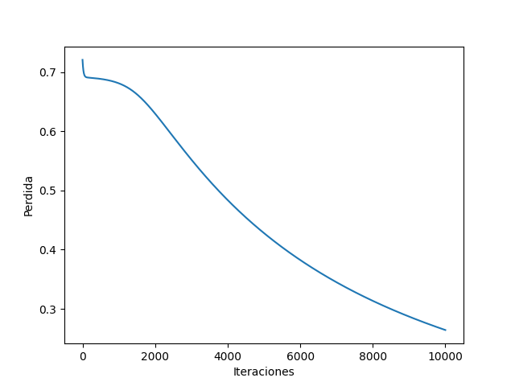
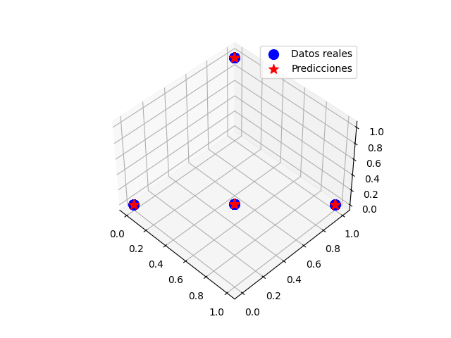

# Practica 11 - MLP

## Problema XOR

Es un problema presente en las redes neuronales al tratar de obtener como salida un el resultado de una operación XOR en dos entradas binarias. En donde solo debería devoler 1 si ambas entradas no son iguales o 0 si son iguales.

XOR es un problema de clasificación y uno para el cual las salidas esperadas son conocidas de antemano. Por lo tanto, es apropiado utilizar un enfoque de aprendizaje supervisado.

### Conjuntos de datos
En este caso tenemos los conjuntos de datos XOR_trn.csv y XOR_tst.csv de entrenamiento y prueba respectivamente los cuales ambos cuentan con dos variables independientes que deben producir un resultado de 1 y 0.

### Procesamiento de datos
En el caso de las variables independientes hace falta normalizar los resultados para poder obtener representaciones binarias de estos para usar en el modelo y para la variable dependiente solo hace falta reemplazar los valores -1 por 0.

### Modelo
Para los detalles de la implementación del modelo favor de revisar la [nota de jupyter](MLP-XOR.ipynb), pero basicamente use una red de dos capas de entrada, una de salida y dos ocultas entrada durante 10000 iteraciones con los pesos iniciados de forma aleatoria. En la que el resultado predecido lo considero un 1 si es mayor o igual a 0.5 o 0 en caso contrario.

### Perdida conforme las interaciones

### Resultados de predicciones

Tras entrenar tres modelos y escoger el que mejor resultados dio se logro una precisión del 100%.
